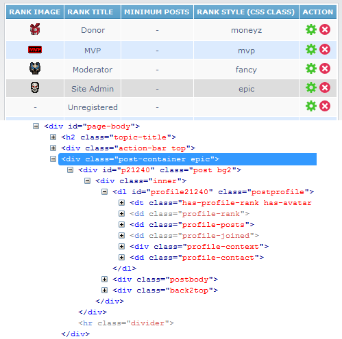
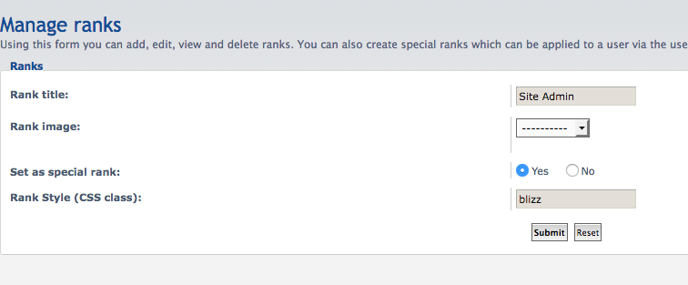

# Rank Post Styling for phpBB 3.3

A phpBB extension that lets you assign a CSS class to each special rank. The class wraps the user's posts, search results, and profile view, allowing you to style them however you like — custom colors, backgrounds, images, etc.

## Features

- Assign a CSS class to any special rank via ACP > Manage Ranks
- Class is applied to posts (viewtopic), search results, and member profiles
- Small rank images toggle (overlays rank icon on avatar, used by PBWoW3 styles)
- Includes a base example class (`rankpoststyle1`) and predefined styles for PBWoW3 and PBWoW3 Heroes
- Works with any style — define your own CSS classes for prosilver or custom styles

## Supported styles

| Style | Included CSS classes |
|---|---|
| **All** (base) | `rankpoststyle1` — a simple example class that colors post content blue |
| **PBWoW3** | `blizz`, `mvp`, `propass` — Blizzard/MVP content colors, Propass avatar overlay |
| **PBWoW3 Heroes** | `blizz`, `mvp`, `propass` — post background images, avatar sprites, profile backgrounds |

## Requirements

- phpBB 3.3.0 or higher
- PHP 7.1.3 or higher

## Languages

Arabic, Croatian, Czech, Dutch, English, French, German, German (Sie), Italian, Polish, Portuguese, Russian, Slovak, Spanish, Spanish (tuteo), Swedish, Turkish, Ukrainian

## Installation

1. [Download the latest release](https://github.com/avandenberghe/RankPostStyling/releases) and unzip it.
2. Copy the contents to `/ext/avathar/rankpoststyling/`.
3. In ACP, go to `Customise -> Manage extensions`.
4. Find `Rank Post Styling` under "Disabled Extensions" and click `Enable`.

## Usage

### Assigning rank styles

1. Go to ACP > Users and Groups > Manage Ranks.
2. Edit a special rank and enter a CSS class name in the "Rank Style" field.
3. Posts by users with that rank will be wrapped in a container with your class applied.





### Which class names can I use?

The extension ships with a base example class `rankpoststyle1` that works with any style. If you use a PBWoW3 style, the classes `blizz`, `mvp`, and `propass` are also available with predefined styling.

You can also define your own classes in your style's CSS:

```css
.myrank .content { color: #00C0FF; }
.myrank .content strong { color: #FFF; }
```

Then enter `myrank` as the Rank Style in ACP.

### Small rank images

This global setting is found in ACP > Board Configuration > Board Features under the "Rank Post Styling" section.

When enabled, rank images display as small overlays on the user avatar instead of in the standard position below it. This feature is designed for PBWoW3 styles.

## Uninstallation

1. In ACP, go to `Customise -> Manage extensions`.
2. Click `Disable` for `Rank Post Styling`.
3. To permanently uninstall, click `Delete Data`, then delete the `/ext/avathar/rankpoststyling/` folder.

## License

[GNU General Public License v2](https://opensource.org/licenses/GPL-2.0)

(c) 2015 - PayBas
(c) 2020 - Sajaki
